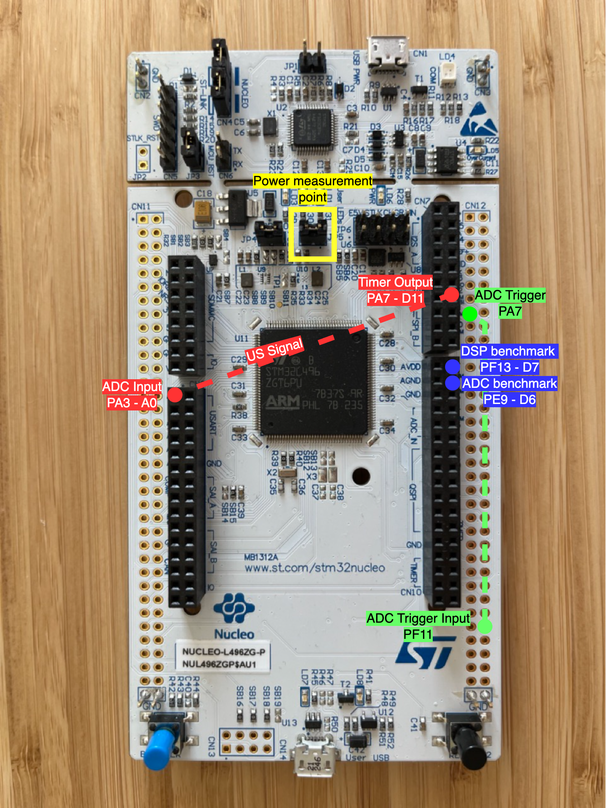

<div align="center">
  
</div>
<p align="center">
    <div align="center"><h1>Heart rate extraction with A-Mode ultrasound</h1></div>
</p>
<div align="center">
		<em>Developed with the software and tools below.</em>
</div>
<div align="center">
	
	
	
	
</div>

<br><!-- TABLE OF CONTENTS -->
Table of Contents:
- [Overview](#overview)
- [Features](#features)
- [Source Description](#source-description)
- [Getting Started](#getting-started)
  - [Installation](#installation)
  - [Usage](#usage)
    - [Mode selection](#mode-selection)
    - [Input signals](#input-signals)
- [License](#license)
- [Acknowledgments](#acknowledgments)
<hr>

##  Overview

In this research paper, we delve into the feasibility of extracting heart rate from the wrist with ultrasound signals in a wearable scenario by using a single ultrasound transducer in A-Mode (amplitude mode).
We first wanted to determine the optimal transducer placement on the wrist, so we collected a dataset on 10 healthy subjects in three differentn wrist positions. A ECG chest belt has been used as ground truth.
We employ an analog envelope circuit to reduce the bandwidth of the ultrasound signal: this reduction enables the signal to be acquired and processed by a common off-the-shelf (COTS) microcontroller (MCU). Both raw and enveloped ultrasound echos are collected and analysed.

Our work introduces a proof-of-concept wearable ultrasound system that achieves high-accuracy heart rate extraction. We address considerations related to power consumption, computation, and memory complexities. Notably, our approach leverages low-power and energy-efficient ultrasound technology, demonstrating ECG-level accuracy in heart rate extraction across a sample of ten individuals.

---

##  Features

The code provided in this repository was used in the paper: TODO. 
It can acquire the enveloped ultrasound signal and extract the heart rate data from it with embedded digital singal processing.
The code in this repository is written for a STM32L496 MCU from ST Microelectronics. It provides the following main features:

- **Signal acquisition**: The code sets up the MCU's on-board analog to digital converter (ADC) and the direct memory access (DMA) to automatically sample the signal and store it in a buffer. It is possible to send the acquired signal to the PC and use the system as an acquisition platform.

- **Heart Rate Extraction**: The code includes the signal processing to extract heart rate data from the ultrasound signal. CMSIS-DSP optimised libraries are used to achieve fast computation and low power consumption. The DSP can be tested and benchmarked via custom data either sent via UART or saved on the device at compile time.

- **Demo**: The code has a demo function that acquires the ultrasound data, saves them in a buffer, extracts the heart rate and displays it on a serial monitor.

---

## Source Description

The project follows the standard project structure of STM32CubeIde. In particular the following folders are of importance:

- Core: this folder contains the HAL (Hardware Abstraction Layer) wrappers, the syscalls and the startup file for the application.
- Debug: this folder contains the Makefiles and the binary files to compile and flash the MCU. Moreover, it containes the object files and dependancy files from the C code compilation, which are ignored in this git repository.
- Drivers: this folder contains the ST HAL and CMSIS libraries for the STM32L4 used in this project. Moreover, this folder contains the CMSIS-DSP source files used to efficiently extract the heart rate from ultrasound data.
- **embd_us**: this folder contains the main() function and the code to acquire the data, extract the heart rate and display it in real time on the terminal. In particular the following files are of interest:
  - **settings.h**: this file contains the settings for the program. You can set the mode the program operates (more in [Operating modes](#operating_modes)), the amount of samples the ADC captures, the DSP window and buffer.
  - **adc_callback.c**: this file contains the callback from the ADC end of conversion interrupt.
  - **dsp.c**: this files contains the digital signal processing. It also contains some UART transmit function for the valiation of the different DSP steps.
  - **handshake.c**: this file contains the code for the handshake between the MCU and the PC (python code) and functions to exchange protocol informations.
  - **main.c**: this file contains the main function and the core of the application's operation.
  - **matrix.c**: this file contains functions operating on matrixes.
  - **printf.c**: this file redirects the printf output to the UART.

---

##  Getting Started

**System Requirements:**

* **STM32CubeIDE**: `Tested on STM32CubeIDE 1.14.0`
Or
* **arm-none-eabi** toolchain and your favourite MCU flasher/debugger.

###  Installation

1. Clone the  repository:
```console
$ git clone https://github.com/mgiordy/Ultrasound-Heart-Rate-MCU.git
```

2. Change to the project directory:
```console
$ cd Ultrasound-Heart-Rate-MCU
```

3. Load the project inside STM32CubeIDE. The easiest way is to import the zip file proided in this repository (it contains the same code of the repository).
```console
file -> open project from filesystem -> archive -> finish
```

4. Compile the project and flash the code on the MCU


---
###  Usage

#### Mode selection

The following modes are available. Make sure to set only one to 1 at the time for correct operation.

- **MODE_ADC_VALIDATION**: Use this mode for testing the ADC and to acquire data. It needs to be used in conjunction to the [adc_checker.ipynb](https://github.com/mgiordy/Ultrasound-Heart-Rate-Data-Analysis/blob/main/adc_checker.ipynb) jupyter notebook.
- **MODE_DSP_VALIDATION**: Use this mode to validate the DSP against a Python impelemntation. It shall be run with the companion jupyter notebook: [dsp_checker.ipynb](https://github.com/mgiordy/Ultrasound-Heart-Rate-Data-Analysis/blob/main/dsp_checker.ipynb)
- **MODE_DSP_SELFTEST**: Use this mode to test the DSP against a set of input data saved on the device. It provides readable output on the serial terminal with a `921600` baud rate.
- **MODE_DEMO**: Use this mode to test the system, acquire data, process them and extract the heart rate with onboard DSP.  It provides readable output on the serial terminal with a `921600` baud rate.

#### Input signals

To make the work as reproducible as possible, we used the [L496ZG-P](https://www.st.com/en/evaluation-tools/nucleo-l496zg-p.html) Nucleo board from ST Microelectronics. 
The following pins have been used:
- **ADC1 IN8 - PA3**: Analog ADC input, it should be used to sample the enveloped ultrasound signal. It corresponds on **pin A0** on the Nucleo board.
- **ADC1 EXTI11 - PF11**: Digital ADC trigger input, it should be used to start the ultrasound sampling (connect to the TX ON pin from pulser). It corresponds to the 6th pin in the outern bottom right Morpho connector.
- **TIM3 CH2 - PA7**: Fast-time square wave output, it can be used to simulate the ultrasound signal. Should be connected to ADC1 IN8 to test the ADC. It corresponds to **pin D9** on the Nucelo board.
- **TIM4 CH4 - PD15**: Slow-time square wave output, it can be used to simulate the ultrasound trigger signal. Should be connected to ADC1 EXTI11 to test the ADC. It corresponds to **pin D11** on the Nucleo board.
- **PE9**: GPIO to signal the DSP running. It can be used for DSP benchmarking. It corresponds to **pin D6** on the Nucleo board.
- **PF13**: GPIO to signal the ADC running. It can be used for ADC benchmarking. It corresponds to **pin D7** on the Nucleo board.

Here's a visual representation of connections:
<div align="center">
  
</div>

---
---

##  License

This project is licensed under the [Apache License 2.0](https://www.apache.org/licenses/LICENSE-2.0). For more details, refer to the [LICENSE](LICENSE) file.

---

##  Acknowledgments

If you use the data or the code present in this repository please cite the follpwing paper:

- M. Giordano et. Al. TODO


---
